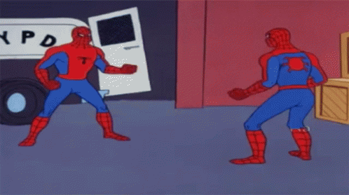
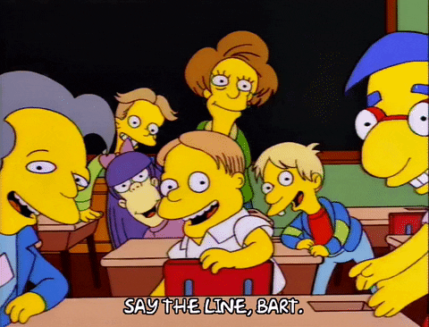

---
output:
  md_document:
    variant: markdown_github
---

<!-- README.md is generated from README.Rmd. Please edit that file -->

```{r, echo = FALSE}
knitr::opts_chunk$set(
  collapse = TRUE,
  comment = "#>",
  fig.path = "figure/",
  fig.height = 1
)
```

# ColourSauce: Colours From The Sauce

*You buy you some orange juice, how long's that going to last in your fridge? Couple days, maybe? That's the juice. How long does BBQ sauce last in your fridge? A while. That's the sauce, man. It sticks around. It's thick, hard to move.*

<p align="center">
{#id .class width=150% height=100%}
</p>

> Does picking the right colours stress you? No worries mate, I got you!

These are are some hand picked colour palettes I've chosen to spice them boring plots to something everyone can get around! This package was inspired by the [WesAnderson package](https://github.com/karthik/wesanderson) which derived it's colour palette from the amazing Tumblr blog [Wes Anderson Palettes.](http://wesandersonpalettes.tumblr.com/)


## Installation

```r
devtools::install_github("CodeByHarri/ColourSauce")
```

## Usage

```{r, palettes_dummy}
library("ColourSauce")

# See all palettes
names(saucecolours)
```

## Palettes

A show case of the palettes by category of inspiration.

> *Memes & Movies*

#### Spiderman (1967)
<p align="center">
{#id .class width=150% height=100%}
</p>

```{r, memes}
# coloursauce("Spiderman")
```


#### Spongebob (1999)
<p align="center">
{#id .class width=100% height=100%}
</p>


#### The Office (2005)
<p align="center">
{#id .class width=100% height=100%}
</p>

```{r, memes}
# coloursauce("TheOffice")
```


#### Gunshow (2013)

<p align="center">
{#id .class width=100% height=100%}
</p>
```{r, memes}
# coloursauce("Gunshow")
```


#### The Simpsons (1994)
<p align="center">
{#id .class width=150% height=100%}
</p>

```{r, memes}
# coloursauce("TheSimpsons")
```


My top 10 favourites from [coolors.co](https://coolors.co/palettes/popular)

### coolors.co

```{r, coolors}
coloursauce("CoolRdBu")
coloursauce("CoolHeat")
coloursauce("CoolContrast1")
coloursauce("CoolContrast2")
coloursauce("CoolCocoa")
coloursauce("CoolGnRd")
coloursauce("CoolDarkLava")
coloursauce("CoolSageBrown")
coloursauce("CoolBlueCopper")
coloursauce("CoolShadowRose")

```


# Discrete Example

```{r, ggplot1, fig.height = 3}
library("ggplot2")
ggplot(mtcars, aes(factor(cyl), fill=factor(vs))) +  geom_bar() +
  scale_fill_manual(values = coloursauce("CoolDarkLava"))
```

# Continuous Example


```{r, volcano, fig.height = 3}
pal <- coloursauce("CoolHeat", 21, type = "continuous")
image(volcano, col = pal)
```

```{r, zissou_heatmap, fig.height = 3}
pal <- coloursauce("CoolHeat", 100, type = "continuous")
# heatmap is a local dataset
ggplot(heatmap, aes(x = X2, y = X1, fill = value)) +
  geom_tile() + 
  scale_fill_gradientn(colours = pal) + 
  scale_x_discrete(expand = c(0, 0)) +
  scale_y_discrete(expand = c(0, 0)) + 
  coord_equal() 
```


