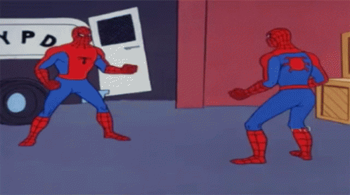

<!-- README.md is generated from README.Rmd. Please edit that file -->

ColourSauce: Colours From The Sauce
===================================

*You buy you some orange juice, how long’s that going to last in your
fridge? Couple days, maybe? That’s the juice. How long does BBQ sauce
last in your fridge? A while. That’s the sauce, man. It sticks around.
It’s thick, hard to move.*

<p align="center">

</p>

> Does picking the right colours stress you? No worries mate, I got you!

These are are some hand picked colour palettes I’ve chosen to spice them
boring plots to something everyone can get around! This package was
inspired by the [WesAnderson
package](https://github.com/karthik/wesanderson) which derived it’s
colour palette from the amazing Tumblr blog [Wes Anderson
Palettes.](http://wesandersonpalettes.tumblr.com/)

Installation
------------

``` r
devtools::install_github("CodeByHarri/ColourSauce")
```

Usage
-----

``` r
library("ColourSauce")

# See all palettes
names(saucecolours)
#>  [1] "CoolRdBu"       "CoolHeat"       "CoolContrast1"  "CoolContrast2" 
#>  [5] "CoolCocoa"      "CoolGnRd"       "CoolDarkLava"   "CoolSageBrown" 
#>  [9] "CoolBlueCopper" "CoolShadowRose" "TheSimpsons"    "Spiderman"     
#> [13] "Spongebob"      "TheOffice"      "Gunshow"
```

Palettes
--------

A show case of the palettes by category of inspiration.

> *Memes & Movies*

#### Spiderman (1967)

<p align="center">

</p>

``` r
coloursauce("Spiderman")
```


#### Spongebob (1999)

<p align="center">

</p>

``` r
coloursauce("Spongebob")
```


#### The Office (2005)

<p align="center">

</p>

``` r
coloursauce("TheOffice")
```


#### Gunshow (2013)

<p align="center">

</p>

``` r
coloursauce("Gunshow")
```


#### The Simpsons (1994)

<p align="center">

</p>

``` r
coloursauce("TheSimpsons")
```


My top 10 favourites from
[coolors.co](https://coolors.co/palettes/popular)

### coolors.co

``` r
coloursauce("CoolRdBu")
```


``` r
coloursauce("CoolHeat")
```


``` r
coloursauce("CoolContrast1")
```


``` r
coloursauce("CoolContrast2")
```


``` r
coloursauce("CoolCocoa")
```


``` r
coloursauce("CoolGnRd")
```


``` r
coloursauce("CoolDarkLava")
```


``` r
coloursauce("CoolSageBrown")
```


``` r
coloursauce("CoolBlueCopper")
```


``` r
coloursauce("CoolShadowRose")
```


Discrete Example
================

``` r
library("ggplot2")
ggplot(mtcars, aes(factor(cyl), fill=factor(vs))) +  geom_bar() +
  scale_fill_manual(values = coloursauce("CoolDarkLava"))
```


Continuous Example
==================

``` r
pal <- coloursauce("CoolHeat", 21, type = "continuous")
image(volcano, col = pal)
```


``` r
pal <- coloursauce("CoolHeat", 100, type = "continuous")
# heatmap is a local dataset
ggplot(heatmap, aes(x = X2, y = X1, fill = value)) +
  geom_tile() + 
  scale_fill_gradientn(colours = pal) + 
  scale_x_discrete(expand = c(0, 0)) +
  scale_y_discrete(expand = c(0, 0)) + 
  coord_equal() 
```


### Error and bug fixes

> remove.packages(“ColourSauce”, lib=“\~/R/win-library/4.0”)

> detach(“package:ColourSauce”, unload = TRUE)

> devtools::install\_github(“CodeByHarri/ColourSauce”)
